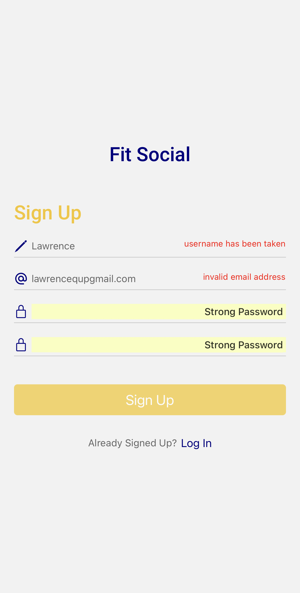
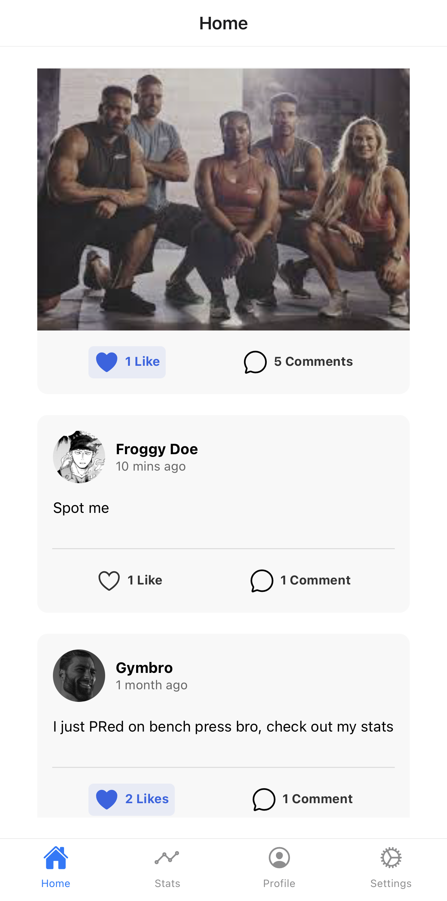
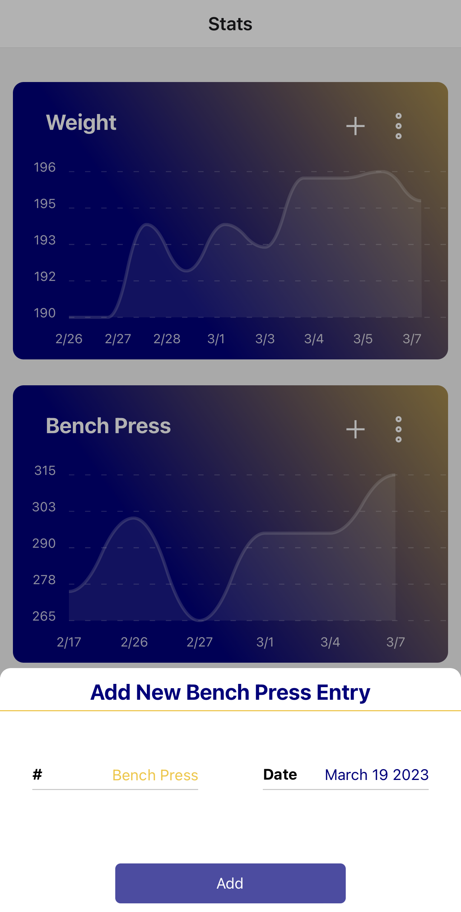

Fit Social is a primarily mobile social media platform that allows users to track, share, and compare their fitness progress. The ultimate goal of Fit Social is to bring people who have the same passion for fitness together and help them to gain motivation and information toward accomplishing their fitness goals.

Fit Social uses Rust with Rocket.rs and SurrealDB in the backend, and React Native and Node for the frontend.

## Screenshots

<p align="middle">
     
    
    
</p>

## Repo structure

[Dev doc](./DevDoc.md) Documentation for developers.

[User doc](./UserDoc.md) Documentation for users.

[docs](./docs): The organizational documents relevant to the project; schedules, goals, and roles.

[frontend](./frontend): Files relevant to the frontend of the project; static frontend files.

[backend](./backend): Files relevant to the backend of the project; static backend files.

## Currently implemented features

- Backend infastructure (authentication, database, model, and network layer)
- Frontend application navigation infastructure
- Ability to add fitness data widgets, with insights like progress in a given timeframe
- Ability to upload and track fitness data on widgets
- Main page and content viewing
- Settings

## Running for development

Before running, make sure you have [Rust installed](https://www.rust-lang.org/tools/install) and on the [frontend directory](./frontend) run

```shell
npm i
```

To run the backend server, go to [backend](./backend) and switch to the nightly version of rust

```shell
rustup default nightly
```

Then, run

```shell
cargo run
```

To serve the frontend, go to [frontend](./frontend) and run

```shell
npm start
```

You can then scan the QR code or click on the entry in Expo Go to run on mobile. You may be able to run the app on a Mac using an emulator, more information can be found [here](https://docs.expo.dev/workflow/ios-simulator/). It has not been tested if the app works on Android, but theoretically it should work. Note we do not currently support running the frontend on web.

## Testing

You can test the backend by going to the [backend](./backend) and running 

```shell
cargo test
```

You can test if the frontend builds by going to the [frontend](./frontend) and running 

```shell
npm run build --if-present
```
