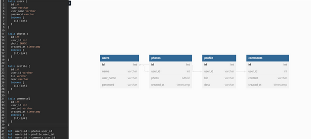

## Software and Architecture

### Components

- View: This will be what the client accesses and sees, the structure of the application that is displayed to the user, user interaction
- Presenter: This will be handling the user requests/manipulations as well as updating the viewer based on said manipulations of the data model
- Model: This will be a representation of the user’s data created 
- Database Layer: the protocol which models interact with the database.

### Interfaces

- View and presenter interact via the UI like buttons and form requests. This is how the user interacts with the platform.
- The presenter layer uses HTTP requests to send messages to and from the frontend (view) and backend (model and database)
- The presenter sends requests to the model components in the backend, specifying how the state of the application should change or what information the frontend requires. At this level, the HTTP requests are translated to Rust types that can be interacted with.
- Model and database layer interact through its protocols that are tracked down 

### Assumptions

We’re assuming the database is stored locally in the project repository as opposed to the cloud. This can easily be changed to be on the cloud once it is time to deploy the platform.

### Data

Our data system stores user data whether that be the user photos, comments, username, password, profile descriptions, and videos. This is done through a database formatted in a schema like this : 

### Alternatives 

1. An alternative to our architecture would be where we store our users information. We could use a server database to store the information or the cloud to store information. A pro for this would be the amount of data able to store in the server or cloud would be substantially more than just our local project repo. A con would be the time it takes to get that information and how to figure out how to store it exactly.

2. Another alternative for our architecture would be breaking the app down into smaller independent services that communicate with each other through APIs. The Pros of this is this allows for more flexibility, scalability and easier maintenance. The cons of this would be alot of different APIs. We would have trouble reading and understanding each API since they would be so different but comments would help with that.

## Software Design

- View: responsible for displaying to the user what the application looks like, including its features. This includes cross-platform compatible UI and graceful error handling.
  - Built up via React components and libraries like [React Bootstrap](https://react-bootstrap.github.io/)
- Presenter: responsible for collecting the user’s request and changes to their profile
    - Server side binary in the backend code. Uses [Rocket](https://rocket.rs/) to serve data and set up request endpoints.
- Model: responsible for defining and providing methods to interact with the platform’s state. This includes user information, picture/video information, user comments, etc.
  - Models are defined multiple ways. Rust structs modeling this data gets [automatically exported](https://docs.rs/ts-rs/latest/ts_rs/) to Typescript in order to maintain consistency. There are models that contain the information of a complete database entry (user/post/comment/etc), and the information to create, update, and delete these entries.
- Database Layer: responsible for storing and querying all the information relating to the user profiles and transactions
  - Database interaction is abstracted by [SurrealDB](https://surrealdb.com/) and further abstracted by our protocol defining the methods and types that interact with the database. For example, only model types that are `Creatable` (implement that Rust trait) can create a new database entry, and is passed in to a method that handles execution of the relevant SuQL query.

## Coding Guidelines

- Rust: [Style Guidelines (rust-lang.org)](https://doc.rust-lang.org/1.0.0/style/README.html)
We chose to follow the style guidelines given by the developers of Rust, both in trust that the developers understand the language best and because it is what we as developers are used to following and find clarity in.

- React Native: https://github.com/Wolox/tech-guides/blob/master/react-native/style-guide.md
We chose to follow the Wolox guide as it is based off of the readability of the components

- REST API / Network: https://stackoverflow.blog/2020/03/02/best-practices-for-rest-api-design/
We chose this style guide because of the strength of one of the writers, John Au-Yeung, and the principles we agreed with and found value in like using nouns in endpoint paths.

## Process Description

### Risk Assessment

1. Risk 1: Inability to upload videos within the app 
  - Likelihood: Medium 
  - Impact: High; Reduced app functionality, negative user experience, and loss of user trust 
  - Steps to reduce risk: Search for videos and resources on implementing the video upload feature, store videos in a large enough database, use Youtube or another streaming device as a contingency plan, or compress videos to fit in the database. 
  - Detection: Run automated tests to check if photo posts and video posts are visible on the app.
  - Mitigation Plan: If we aren’t able to upload videos on Fit Social and search for videos and resources on how to implement them. Then we find a database large enough to store the videos posted. Then we either upload the videos to some streaming service or embed the videos onto the app. If possible, we compress the videos to minimize storage requirements. Then we run automated tests to check if the videos posted on FitSocial are visible on the app.
2. Risk 2: Sign-up page not properly creating and storing new user accounts 
   - Likelihood: Low 
   - Impact: High; Limited access to app features and loss of user trust 
   - Steps to reduce risk: Minimize the data required to create a user account, store only the bare minimum of data (username, email, password), and keep the database from running out of storage space. 
   - Detection: Create new user accounts and check if their information is stored in the database. Assert if the specific user information is contained in the database.
   - Mitigation Plan: If the sign up page isn’t properly creating a new user and storing it in the database, we will first minimize the amount of data required to create the users. Then we would store only the bare minimum of user information (things such as usernames, emails, and passwords). Then we create a new user and check again if their data is stored in the database and assert if the specific user data is contained from within the database.
3. Risk 3: Comments not displayed for every post 
   - Likelihood: Low 
   - Impact: High; Loss of an important feature of the app and reduced user engagement 
   - Steps to reduce risk: Store comments in an easily accessible area of the database, ensure front-end display can accommodate comments regardless of text length. 
   - Detection: Add a series of comments to a database of a post and assert if the specific comments were displayed on the post and stored in the database.
   - Mitigation plan: If this occurs due to a network error on the server side, inspect error and fix as required.
4. Risk 4: User inability to log in to the app
- Likelihood: Low
- Impact: High; Deterrence of user usage and loss of access to app features
- Steps to reduce risk: Prompt users to only enter their username and password, have a "remember me" feature for previously logged-in users.
- Detection: Simulate logins for various users and assert if they reach the home page after clicking the login button with the needed password and username.
- Mitigation plan: If this occurs due to a network error on the server side, inspect error and fix as required.
5. Risk 5: Dependency on Third-Party Libraries Services Like Cloud Storage Providers:
   - Likelihood: Medium
   - Impact: Interruptions in service and reduced app functionality, leading to a negative user experience and loss of user trust.
   - Steps to Reduce Risk: Research reliability of these services and libraries and have alternatives ready.
   - Detection: Regularly monitor the performance of third-party reliant code, and have a process in place to quickly address any disruptions in the cloud (once we move to the cloud.
   - Mitigation Plan: refactor the platform to use alternatives.

### Project Schedule

- Frontend:

    These are rough deadlines for frontend features.
    - [ ] Jan 29: User login and profile page
    - [ ] Feb 6: User stats page & content uploading
    - [ ] Feb 13: Main feed page
    - [ ] Feb 20: Comment section, mentions, and direct messaging pages
    - [ ] Mar 1: Quality of life + UI enhancements

- Backend:

    These are rough deadlines for backend features.
    - [x] Jan 29: Database schemas, user authentication, and user data persistence
    - [ ] Feb 13: User fitness data retrieval and augmentation and fitness statistcs
    - [ ] Feb 20: Platform-wide content serving based on calculated user preferences
    - [ ] Mar 1: Irrelivant content filtering, comment persistence, automated moderation

### Test Plan and Bugs

We plan to test our REST APIs, intuitive user interfaces, user security, and storage of user pictures and comments. We will make use of Github Actions in order to trigger automatic build and tests with every pull request to our repository.

In order to track bugs throughout testing, we will be using Github Issues in order to assign, make note of, and keep track of any bugs throughout our development. Our strategy in terms of unit testing will be to test each class for critical functionality

Our strategy for integration testing will be to test via a Big Bang approach where our components will be integrated together, then tested as one unit. Our strategy for usability testing will be to get a couple friends, those that go to the gym, and ask them to go through our app’s main features while asking for feedback. 

### Documentation Plan
	
As we program, we intend to document on the fly. This is not only for others’ reference, but also the programmer to plan out the details of their implementation.
	
For the backend, we will user Rust’s built-in [documentation features](https://doc.rust-lang.org/rustdoc/what-is-rustdoc.html) and can use that to later export everything to be searchable and human readable to [Docs.rs](https://docs.rs/).

React has similar features and we’ll use that for the frontend.

As needed, we will create READMEs to explain how to use and develop the program. As we publish to the LoginScreen Store we will add descriptions and guides as necessary.
