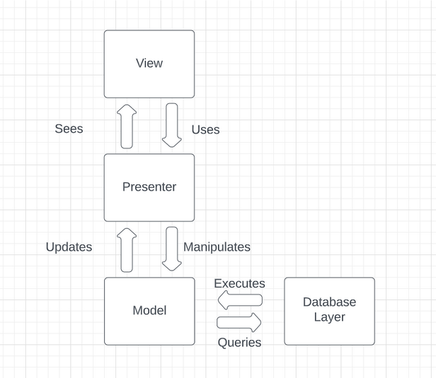
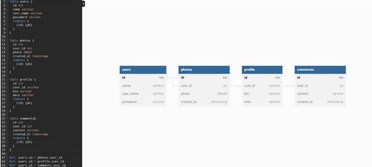

# Requirements & Team Policies

This document defines the Fit Social project. It outlines the project's goals, requirements, and high-level implementation, including how the Fit Social team will operate to reach these goals.

## Team Info & Policies

### Team members

- Lawrence: In charge of backend and project architecture.
- Aaron: In charge of frontend and databases
- Matthew: In charge of both frontend and backend.
- Michael: In charge of backend 
- Asher: In charge of frontend and management
  
### Project Artifacts

- [Github](https://github.com/Monacr/FitSocial)
- [Proposal Presentation](https://www.youtube.com/watch?v=yyrZGDSW64g)

### Communication 

 - Slack channel: fully on topic, CSE 403 assignment focused discussion.
 - Discord server: on topic for each channel e.g. `#backend` will be only to talk about the backend portion of the project.

## Product Description

Fit Social is a primarily mobile social media platform that allows users to track, share, and compare their fitness progress. The ultimate goal of Fit Social is to bring people who have the same passion for fitness together and help them to gain motivation and information toward accomplishing their fitness goals.

### Features

1. One of the features that we will be implementing is a progress-posting system that allows users to post their workout progress via photos or videos, and attach numbers (like the amount of weight lifted) that can be analyzed by the platform across other data that can provide useful content and information.

2. The platform will serve short form content strictly related to fitness. Unlike other social media platforms that distribute content, focusing on this area allows users to immerse themselves into fitness and will be much more likely to reach their goals if they consume only content that promotes working towards their goals.

3. Another feature is the fitness statistcs and tracking tools. Integrating with the (IOS and Android) Health API, allowing users to track progress in-app, and aggregating data and running queries across the user base allows users to get a unique but useful analysis of their progress and how to optimize for more.

4. We want to be a hub for fitness communities. This means we need to support social features like commenting, direct messaging, profile management, and anything else that allows for a more connected fitness user base.

### Stretch Goals

1. In order to maintain order across the platform we could, given we have time, build automated moderation features that enforce the community guidelines. This can include flagging possibly misleading information or enforcing civility in comment sections.

2. Users want only relevant content in their feed. We can implement and automated recommendation system that aggregates user preference data to serve only the most desired content for each user.

## Use Cases

### Matthew: User feed interaction

1. Actors: User that wants to view feed
2. Triggers: User presses home feed button
3. Preconditions: User has an account and is logged in
4. Postconditions: User views home feed
5. List of steps:
   - User clicks home feed button
   - System collects user preference data
   - System sorts posts by relevancy to user
   - System serves 10 most relevant posts
   - System presents feed data to user
   - User views home feed
6. Variations:
   - User account has been blocked from another user’s content, thus being unable to view some posts that they normally would be able to view
   - System cannot find relevant posts to show user in main feed, thus presenting posts based on other criteria like popularity
7. Exceptions:
   - User does not have account, thus is unable to access a home feed
   - User clicks login
   - User enters username and password
   - System invalidates given information
   - Sends user back to login
   
### Asher: Comment Section

1. Actors: A user that wants to comment on a post
2. Triggers: User clicks "comment" on a post's comment section
3. Preconditions: User is logged in
4. Postconditions: A notification pops up for the post creator and the comment is shown below the post and pushed to the database
5. List of Steps:
   - User clicks "comment" on a post's comment section
   - User types and submits comment
   - Comment is analyzed by the automod system (if enabled by post creator)
   - Comment is added to the database
   - UI is updated with comment for all users in the comment section
   - Notification sent to post creator 
6. Variations:
   - Post creator does not have notifications from comments enabled, so no notification is sent
   - Creator does not have automod enable, so comment is not checked other than for following community guidelines.
7. Exceptions:
   - Comment fails automod check and is rejected
   - Commenter is banned from commenting by a post creator and thus cannot comment

### Michael: Posting photos or videos from your gallery/taking a picture or video recording
1. Actors: user wanting to post a picture/video
2. Triggers: allow the user to access their pictures or camera from their device
3. Preconditions: user is on the uploading photos/video screen
4. Postconditions (success scenario):
   - Success: access to all gallery and camera and photo is uploaded on their profile
   - Failure: not having access to the photos and is no photo is uploaded
5. List of steps (success scenario):
   - User presses the photo upload button
   - User decides to either choose photos from their mobile device or take a picture
   - User clicks on the choose photos button or-
   - User clicks on the take photo button
   - User clicks on the photo
   - User chooses to edit the photo (filter, resizing, cropping)
   - User clicks on the next button
   - User chooses to upload a caption for the photo
   - User types a caption
   - User clicks the share button
6. Extensions/variations:
   - User’s changes in their edits are not saved when the user does not choose save
   - User’s caption is not saved when going back to the previous page 
7. Exceptions: failure conditions and scenarios:
   - User uploads a photo that is not related to fitness
   - User connection is blocked by the content filter

        
### Aaron: Creating an account

1. Actors: A user that wants to create a profile on FitSocial.
2. Triggers: The user wants to make an account, see other posts and to post their own pictures.
3. Preconditions: The user has an email and is 16 years or older.
4. Postconditions: The user creates an account and is able to start friending others, posting their own pictures and comment on others.
5. List of steps:
   - The user clicks the sign up button
   - The user is asked for email and password
   - The system asks for a email and password verification for the account
   - The user inputs the email and password verification and is prompted towards another page of information.
   - The system asks for things such as body weight, height, interests and goals, etc.
   - The user inputs the information required
   - User confirms all the information before fully signing up.
6. Variations:
   - The user has already used an email for the account and is prompted to login
   - The user inputs the wrong data so the system alerts the user to try again.
   - The email verification code is wrong so the system prompts to try again.
7. Exceptions:
- Non-matching login information, where the user enters a username or password that does not match with system database of user information, thus being denied access to account
- No account, where the user enters a username and/or password that does not exist, thus being denied from access to account

### Lawrence: Upload new fitness statistcs (weight)

1. Actors: User that has new weight data to upload
2. Triggers: User clicks on the statistics menu
3. Preconditions: User is logged in
4. Postconditions: Frontend and backend updated to reflect new user data
5. List of steps:
   - User chooses a statistic widget to append to listed in the stats page (in this case it is a graph with the user's weight over time)
   - User enters a weight (a real number)
   - User clicks submit
   - Database updated with new information (appened to a list of previous weights along with a timestamp of submission time)
   - UI gets updated to show the weight graph with a new datapoint connected by a line to the last datapoint (if available)
6. Extensions: user may instead edit a preexisting field instead of append
7. Exceptions: user has no previously submitted data, so editing is not possible

## Non-Functional Requirements

### Privacy and security

Security principles will be applied to keep malicious actors from gaining access to information they aren't supposed to access. Privacy will be enforced and users can choose to block other users and hide their profile from the public.

### User experience

Since this project is a social media platform that focuses on reaching as many people as possible, user experience is a priority. The user interface must follow design principles proven to improve UX and accessibility. By using libraries like [bootstrap](https://getbootstrap.com/) we can quickly deploy a high-UX interface.

### Scalability

The code base will follow software engineering principles for readability, modularity, and extensibility. These principles, alongside documentation, will allow the project to be scalable even above the scope of this course.

## External Requirements

1. We require that all known errors are handled accordingly (automatically if possible).
2. The product must be installable or usable through a URL/link. We will either put it on the app store or will have a downloadable link.
3. We will open source the code and provide instructions on how to develop on, build, and run from source.
4. We will keep the scope of the project within the range of 5 students and will scale up or down depending on how it goes through the quarter

## Team Process Description

### Software toolset

- Rust for backend. Rust has a very extensive ecosystem of libraries for web servers like [Actix](https://actix.rs/) and database ORMs like [Diesel](https://diesel.rs/). These tools are the fastest, competing and often beating similar libraries in languages like C++. Unlike C++, Rust's strong type system and compiler lowers the chance of runtime errors and guarantees no memory errors.

- [SurrealDB](https://surrealdb.com/) for database. SurrealDB is a Rust-implemented serverless database that uses a SQL-like query language. This makes it easy to use for those familiar with SQL, and makes simple data retrieval (like user account info) fast on the frontend as it can return JSON directly from the database without needing to go through the backend. This way, the backend would only be used for data aggregation and computation, increasing speed and decreasing complexity.

- ReactJS for the frontend. React is the most popular Javascript framework giving multiple advantages. Not only will developer familiarity remove the need to learn a new technology, React's ecosystem of libraries (React bootstrap, for example) and community support make it easy to develop with. React works so well because it is component based, meaning components can be composed to create complex user interfaces quickly.

### Team member roles

Team member roles are assigned based on technology familiarity and personal preferences in such a way that workloads are evenly split and distinct enough to allow developer independence.

- Lawrence: in charge of backend, project architecture. Will design and build the backend and will define the high-level project architecture (i.e. the technologies and design principles used).
- Aaron: In charge of frontend and databases. Will design and build the frontend, mainly focusing on bringing database data to the frontend and tying that with the UI.
- Matthew: In charge of both frontend and backend. Will build on both the frontend and backend, getting the two to interact effectively.
- Michael: In charge of backend. Will build the backend making sure software design principles are followed.
- Asher: In charge of frontend and management. Will build and design the user interface. Also will make sure deadlines are met and team members are effectively contributing.

### Team schedule

Schedule is listed in chronological feature order in one-person-week units.

- Frontend:

| **Feature**                          | **Deadline** | **Difficulty** | **Dependencies**                    | **Assigned To** | **Completed** |
|--------------------------------------|--------------|----------------|-------------------------------------|-----------------|---------------|
| User login                           | Feb 9        | Easy           | User accounts, authentication       | Asher           |               |
| User signup                          | Feb 9        | Easy           | User accounts, authentication       | Aaron           |               |
| Profile page                         | Feb 14       | Medium         | User accunts, user data persistence | Aaron           |               |
| User stats                           | Feb 14       | Hard           | Profile page                        | Matthew         |               |
| Content uploading                    | Feb 19       | Easy           | Authentication                      |                 |               |
| Main feed                            | Feb 21       | Medium         | Content uploading                   |                 |               |
| Comment section                      | Feb 28       | Hard           | Main feed                           |                 |               |
| Mentions                             | Feb 28       | Medium         | Comment section                     |                 |               |
| Direct messages                      | Feb 28       | Hard           | Profile page                        |                 |               |
| Quality of life and stretch features | N/A          | N/A            | All                                 |                 |               |

- Backend:

| **Feature**                      | **Deadline** | **Difficulty** | **Dependencies**                       | **Assigned To**      | **Completed** |
|----------------------------------|--------------|----------------|----------------------------------------|----------------------|---------------|
| User model                       | Jan 29       | Medium         | N/A                                    | Lawrence             | Yes           |
| Database-model integration       | Jan 29       | Medium         | N/A                                    | Lawrence             | Yes           |
| User authentication endpoints    | Feb 3        | Easy           | User model, database-model integration | Lawrence             | Yes           |
| Cookies                          | Feb 3        | Easy           | User authentication endpoints          | Lawrence and Michael | Yes           |
| Post/content model               | Feb 10       | Medium         | Database-model integration             | Michael              |               |
| Fitness stats API                | Feb 14       | Hard           | User model                             | Lawrence             |               |
| Post API                         | Feb 14       | Easy           | Post/content model                     | Michael              |               |
| Post suggestion algorithm        | Feb 21       | Hard           | Post API                               | Lawrence and Michael |               |
| Direct message API               | Feb 26       | Medium         | User model                             |                      |               |
| Comment model and API            | Feb 26       | Hard           | Post API                               |                      |               |
| Cloud storage and server hosting | Mar 1        | Easy           | N/A                                    |                      |               |
| Irrelivant content filtering     | Mar 1        | Medium         | Post suggestion algorithm              |                      |               |
| Automated moderation             | Mar 1        | Hard           | Comment API                            |                      |               |
    
### Risks

1. Too much new technology. The tech stack contains technology that is unfamiliar to some or all team members. While the challenge and learning experience is a reason for choosing these technologies, there is a world where becoming skilled enough to use the tech stack takes too long.
2. Too many features. To compete with other social media platforms and to make our project useful, we need to build features that usually takes professional teams a lot longer. We must choose which are the most necessary features and execute them well in order to finish on time.
3. Project infrastructure unsuitable for features. If we want to take a data analytics approach to providing user statistics, do automated moderation, serve content based on user preferences, or any other of the platform-defining features, we need to make sure the software we've built has the modularity to support these new features as we develop. If we lack the appropriate infrastructure on the frontend or backend we risk needing to rebuild large parts of the project to support these "lower level" features.

### External feedback

External feedback from users will be very useful once we have the project-defining features like fitness statistics up and running. Other features, like short form content and user preferences already have proven to be a good idea, so those can come later down the line as we already know how a successful implementation looks like.

# Software and Architecture

## Components

- View: This will be what the client accesses and sees, the structure of the application that is displayed to the user, user interaction
- Presenter: This will be handling the user requests/manipulations as well as updating the viewer based on said manipulations of the data model
- Model: This will be a representation of the user’s data created 
- Database Layer: the protocol which models interact with the database.

### Interfaces

- View and presenter interact via the UI like buttons and form requests. This is how the user interacts with the platform.
- The presenter layer uses HTTP requests to send messages to and from the frontend (view) and backend (model and database)
- The presenter sends requests to the model components in the backend, specifying how the state of the application should change or what information the frontend requires. At this level, the HTTP requests are translated to Rust types that can be interacted with.
- Model and database layer interact through its protocols that are tracked down 

### Assumptions

We’re assuming the database is stored locally in the project repository as opposed to the cloud. This can easily be changed to be on the cloud once it is time to deploy the platform.

### Data

Our data system stores user data whether that be the user photos, comments, username, password, profile descriptions, and videos. This is done through a database formatted in a schema like this : 

### Alternatives 

1. An alternative to our architecture would be where we store our users information. We could use a server database to store the information or the cloud to store information. A pro for this would be the amount of data able to store in the server or cloud would be substantially more than just our local project repo. A con would be the time it takes to get that information and how to figure out how to store it exactly.

2. Another alternative for our architecture would be breaking the app down into smaller independent services that communicate with each other through APIs. The Pros of this is this allows for more flexibility, scalability and easier maintenance. The cons of this would be alot of different APIs. We would have trouble reading and understanding each API since they would be so different but comments would help with that.

## Software Design

- View: responsible for displaying to the user what the application looks like, including its features. This includes cross-platform compatible UI and graceful error handling.
  - Built up via React components and libraries like [React Bootstrap](https://react-bootstrap.github.io/)
- Presenter: responsible for collecting the user’s request and changes to their profile
    - Server side binary in the backend code. Uses [Rocket](https://rocket.rs/) to serve data and set up request endpoints.
- Model: responsible for defining and providing methods to interact with the platform’s state. This includes user information, picture/video information, user comments, etc.
  - Models are defined multiple ways. Rust structs modeling this data gets [automatically exported](https://docs.rs/ts-rs/latest/ts_rs/) to Typescript in order to maintain consistency. There are models that contain the information of a complete database entry (user/post/comment/etc), and the information to create, update, and delete these entries.
- Database Layer: responsible for storing and querying all the information relating to the user profiles and transactions
  - Database interaction is abstracted by [SurrealDB](https://surrealdb.com/) and further abstracted by our protocol defining the methods and types that interact with the database. For example, only model types that are `Creatable` (implement that Rust trait) can create a new database entry, and is passed in to a method that handles execution of the relevant SuQL query.

### Coding Guidelines

- Rust: [Style Guidelines (rust-lang.org)](https://doc.rust-lang.org/1.0.0/style/README.html)
We chose to follow the style guidelines given by the developers of Rust, both in trust that the developers understand the language best and because it is what we as developers are used to following and find clarity in.

- React Native: https://github.com/Wolox/tech-guides/blob/master/react-native/style-guide.md
We chose to follow the Wolox guide as it is based off of the readability of the components

- REST API / Network: https://stackoverflow.blog/2020/03/02/best-practices-for-rest-api-design/
We chose this style guide because of the strength of one of the writers, John Au-Yeung, and the principles we agreed with and found value in like using nouns in endpoint paths.

## Process Description
    
### Risk Assessment

1. Risk 1: Inability to upload videos within the app 
  - Likelihood: Medium 
  - Impact: High; Reduced app functionality, negative user experience, and loss of user trust 
  - Steps to reduce risk: Search for videos and resources on implementing the video upload feature, store videos in a large enough database, use Youtube or another streaming device as a contingency plan, or compress videos to fit in the database. 
  - Detection: Run automated tests to check if photo posts and video posts are visible on the app.
  - Mitigation Plan: If we aren’t able to upload videos on Fit Social and search for videos and resources on how to implement them. Then we find a database large enough to store the videos posted. Then we either upload the videos to some streaming service or embed the videos onto the app. If possible, we compress the videos to minimize storage requirements. Then we run automated tests to check if the videos posted on FitSocial are visible on the app.
2. Risk 2: Sign-up page not properly creating and storing new user accounts 
   - Likelihood: Low 
   - Impact: High; Limited access to app features and loss of user trust 
   - Steps to reduce risk: Minimize the data required to create a user account, store only the bare minimum of data (username, email, password), and keep the database from running out of storage space. 
   - Detection: Create new user accounts and check if their information is stored in the database. Assert if the specific user information is contained in the database.
   - Mitigation Plan: If the sign up page isn’t properly creating a new user and storing it in the database, we will first minimize the amount of data required to create the users. Then we would store only the bare minimum of user information (things such as usernames, emails, and passwords). Then we create a new user and check again if their data is stored in the database and assert if the specific user data is contained from within the database.
3. Risk 3: Comments not displayed for every post 
   - Likelihood: Low 
   - Impact: High; Loss of an important feature of the app and reduced user engagement 
   - Steps to reduce risk: Store comments in an easily accessible area of the database, ensure front-end display can accommodate comments regardless of text length. 
   - Detection: Add a series of comments to a database of a post and assert if the specific comments were displayed on the post and stored in the database.
   - Mitigation plan: If this occurs due to a network error on the server side, inspect error and fix as required.
4. Risk 4: User inability to log in to the app
- Likelihood: Low
- Impact: High; Deterrence of user usage and loss of access to app features
- Steps to reduce risk: Prompt users to only enter their username and password, have a "remember me" feature for previously logged-in users.
- Detection: Simulate logins for various users and assert if they reach the home page after clicking the login button with the needed password and username.
- Mitigation plan: If this occurs due to a network error on the server side, inspect error and fix as required.
5. Risk 5: Dependency on Third-Party Libraries Services Like Cloud Storage Providers:
   - Likelihood: Medium
   - Impact: Interruptions in service and reduced app functionality, leading to a negative user experience and loss of user trust.
   - Steps to Reduce Risk: Research reliability of these services and libraries and have alternatives ready.
   - Detection: Regularly monitor the performance of third-party reliant code, and have a process in place to quickly address any disruptions in the cloud (once we move to the cloud.
   - Mitigation Plan: refactor the platform to use alternatives.

### Test Plan and Bugs

We plan to test our REST APIs, intuitive user interfaces, user security, and storage of user pictures and comments. We will make use of Github Actions in order to trigger automatic build and tests with every pull request to our repository.

In order to track bugs throughout testing, we will be using Github Issues in order to assign, make note of, and keep track of any bugs throughout our development. Our strategy in terms of unit testing will be to test each class for critical functionality

Our strategy for integration testing will be to test via a Big Bang approach where our components will be integrated together, then tested as one unit. Our strategy for usability testing will be to get a couple friends, those that go to the gym, and ask them to go through our app’s main features while asking for feedback.

### Test-automation and CI

#### Infastructure

The test-automation infrastructure is Cargo. We chose this because we just used the Rust built in testing. Using the `#[CFG(tests)]` macro, tests will only be compiled when running `cargo test`. Since we are using the built in testing system in Rust, we can simply just add a new test in the same file we want to test on and using the `CFG` macro. We chose Github Actions for our CI service linked by workflows to our project repository [here](../.github/workflows). The reason we chose Github Actions for our CI service was because of the ease of use, the allowance for split YAML files which we use for both our frontend and backend, and the unlimited minutes for public repos.

Here were our considerations:

- Github Actions
  - Pros: Unlimited minutes for public repos, User friendly, Allows for split YAML files for workflow, Easy to use
  - Cons: Tied to github, Not as many tools as alternatives due to newness, lacks complex analytics

- Travis 
  - Pros: Free tier of use, Build matrix, widely used so there is community support, github integration			
  - Cons: Need multiple subscriptions to utilize both SCM and CI/CD services, No plugins, no free enterprise plan. 

- Circle CI
  - Pros: Free tier of use, GPU enhanced build options, Can work with more services then just GitHub, Security with encryption
  - Cons: Not as many plugins, Not as many minutes on free tier of use, only one docker image per job

- MS Azure Pipelines
  - Pros: scalability, integration, automation in building and testing, cost-effective or affordable model, flexibility in multiple languages and platforms 
  - Cons: Complex setup and configure, integration limitations, cost for additional tools, UI hard to navigate

#### Tests

Unit tests are added in the backend by creating a new test function under a test module. Information about how to add a test in rust can be found [here](https://doc.rust-lang.org/book/ch11-02-running-tests.html). Infastructure, build, and lint tests are also executed on both the frontend and backend, defined in the github actions workflows. You can add a new action by editing or adding a new YAML file [here](../.github/workflows).

Pushing changes to our backend folder will trigger the backend CI and pushing changes to our frontend folder will trigger the frontend CI.

### Documentation Plan
	
As we program, we intend to document on the fly. This is not only for others’ reference, but also the programmer to plan out the details of their implementation.
	
For the backend, we will user Rust’s built-in [documentation features](https://doc.rust-lang.org/rustdoc/what-is-rustdoc.html) and can use that to later export everything to be searchable and human readable to [Docs.rs](https://docs.rs/).

React has similar features and we’ll use that for the frontend.

As needed, we will create READMEs to explain how to use and develop the program. As we publish to the App Store we will add descriptions and guides as necessary.
